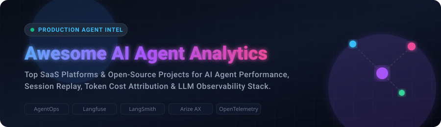

  

# 🤖 Awesome AI Agent Analytics & LLM Observability Ecosystem 📊

  

---

## 📌 Ecosystem Overview & SEO Index

Welcome to the definitive, curated index of **SaaS platforms** and **open-source GitHub projects** for **AI Agent Analytics**, **LLM Observability**, **Agent Session Replay**, **Token Cost Attribution**, and **Production Intelligence**.

As autonomous AI agents shift from single LLM prompt completions to multi-step reasoning, tool invocations, and multi-agent orchestration (e.g., CrewAI, AutoGen, LangGraph, OpenAI Agents SDK), traditional APM monitoring falls short. These specialized tools convert complex agent execution traces into actionable telemetry—enabling software engineers, platform architects, and AI product teams to optimize reliability, debugging latency, and return on investment (ROI).

---

## 📑 Table of Contents
- [🏢 SaaS/Hosted Platforms](#-saashosted-platforms)
- [🔓 Open-Source GitHub Projects](#-open-source-github-projects)
- [🧩 Composable Agent Analytics Stacks](#-composable-agent-analytics-stacks)
- [🤝 How to Contribute](#-how-to-contribute)
- [💖 Support & Sponsorship](#-support--sponsorship)
- [📈 Star History](#-star-history)
- [⚠️ Disclaimer](#%EF%B8%8F-disclaimer)

---

## 🏢 SaaS/Hosted Platforms

> 💡 **Market Insights:** The LLM and AI Agent Observability market is estimated at **$1.7B–$3.2B (2025/2026)** and projected to reach **$8.6B–$24.8B by 2030–2034**. The sector is currently **highly fragmented**—driven by rapid innovation, specialized agent-tracing frameworks (e.g., LangSmith, Arize AX, AgentOps), and OpenTelemetry standardizations, rather than a single winner-take-all enterprise vendor.

| Platform | Company Size (Valuation / Funding) | Starting Paid Tier | Free Tier Limit | Key Highlights & Description |
| :--- | :--- | :--- | :--- | :--- |
| **[LangSmith](https://www.langchain.com/langsmith)** | **$1.25B Valuation** ($160M funding) | **$39 / seat / mo** (Plus plan; $2.50/1k overage traces) | **5,000 base traces / mo** (1 seat, 14-day retention) | Observability, evaluation, and prompt testing platform by LangChain; deep integration with LangGraph. |
| **[Arize Phoenix / Arize AX](https://arize.com/)** | **$915M Acquisition** (by Dynatrace in 2026; $131M funding) | **$50 / mo** (AX Pro tier; $0.0005/span overage) | **25,000 trace spans / mo** (AX Free plan, unlimited evals) | Enterprise AI observability and open-source Phoenix framework for agent tracing, evaluations, and troubleshooting. |
| **[Braintrust](https://www.braintrust.dev/)** | **$800M Valuation** ($121.1M funding) | **$249 / mo** (Pro tier; $1.50/1k scores overage) | **1 GB processed data / mo** (14-day retention, Starter tier) | Evaluation- and feedback-centric platform for AI agents with automated LLM scoring and dataset management. |
| **[Humanloop](https://humanloop.com/)** | **Acquired by Anthropic** ($7.91M prior funding) | **Acquired by Anthropic** (Sunset standalone SaaS Sept 2025; integrated into Anthropic) | **14-day free trial** (2 seats, 50 evals, 10,000 logs/mo) | Prompt engineering, evaluation, and agent monitoring platform acquired by Anthropic in August 2025. |
| **[HoneyHive](https://www.honeyhive.ai/)** | **$7.4M Funding** (Seed led by Insight Partners) | **$99 / mo** (Team plan; usage-based overage) | **10,000 events / mo** (90-day retention, free developer tier) | Observability and evaluation platform purpose-built for multi-step AI agent sessions and tool-call workflows. |
| **[Keywords AI (Respan)](https://www.keywordsai.co/)** | **$5.5M Funding** (Seed stage, YC backed) | **$20 / mo** (Starter tier minimum) | **$15 free credits** (~10,000–50,000 traces) | Unified AI engineering platform and LLM proxy delivering prompt management, tracing, and agent performance dashboards. |
| **[Langfuse (Cloud)](https://langfuse.com/)** | **Acquired by ClickHouse** ($4.5M prior funding, ~$1.1M ARR) | **$29 / mo** (Core tier; 100k units/mo included) | **50,000 usage units / mo** (2 seats, 30-day retention) | Leading open-core LLM/agent analytics product with session replays, prompt management, and automated evaluation tools. |
| **[AgentOps](https://www.agentops.ai/)** | **$2.6M Funding** (Pre-seed led by 645 Ventures) | **$40 / mo** (Pro plan) | **10,000 events / mo** (Developer free tier) | Agent analytics and session replay platform with step-by-step agent tracking and native SDKs (CrewAI, AutoGen). |
| **[Helicone](https://www.helicone.ai/)** | **~$1M ARR** (Seed funded, YC W23) | **$79 / mo** (Pro plan) | **10,000 requests / mo** (1 GB storage, 7-day retention) | Open-source LLM & agent proxy providing instant cost, latency, and request caching/analytics with zero code change. |
| **[OpenLIT](https://openlit.io/)** | **Open-Source** (Community project / Cloud in waitlist) | **Free (Self-Hosted)** (Open-source Apache 2.0; Cloud waitlist) | **Unlimited** (Self-hosted open-source core) | OpenTelemetry-native GenAI & agent instrumentation platform emitting standard metrics to Grafana, Jaeger, and ClickHouse. |

---

## 🔓 Open-Source GitHub Projects

Below is the collection of premier self-hosted and open-source frameworks for agent telemetry, evaluations, and LLM observability. These repositories allow engineering teams to maintain total data sovereignty and privacy.

*(Sorted descending by GitHub Star count)*

| Repository & Link | Stars Badge | Primary Capabilities & Focus Area |
| :--- | :--- | :--- |
| **[Langfuse](https://github.com/langfuse/langfuse)** |  | **End-to-End Agent Platform:** MIT-licensed core offering tracing, session replays, prompt analytics, and LLM evaluations. The gold standard for self-hosted agent observability. |
| **[Promptfoo](https://github.com/promptfoo/promptfoo)** |  | **Red-Teaming & Evals:** CLI & library for security pentesting, vulnerability scanning, hallucination detection, and prompt quality regression tests across agents. |
| **[Opik](https://github.com/comet-ml/opik)** |  | **Evaluation & Tracing:** Open toolkit by Comet for tracing agent runs, evaluating multi-step chains, and tracking experiment performance side-by-side. |
| **[DeepEval](https://github.com/confident-ai/deepeval)** |  | **Unit Testing for Agents:** Pytest-like evaluation framework for LLMs and autonomous agents with support for G-Eval, answer relevancy, and tool-use accuracy. |
| **[Ragas](https://github.com/vibrantlabsai/ragas)** |  | **RAG & Agent Evals:** Specialized framework for evaluating Retrieval-Augmented Generation pipelines, context precision, and multi-turn agent reasoning. |
| **[Arize Phoenix](https://github.com/Arize-ai/phoenix)** |  | **Tracing & Visualization:** Open-source, OpenInference-native observability notebook workspace and server for LLM applications and agent trajectories. |
| **[Promptflow](https://github.com/microsoft/promptflow)** |  | **Microsoft AI Orchestration:** Complete suite of tools to prototype, test, evaluate, and monitor production quality of LLM-based applications and agents. |
| **[Evidently](https://github.com/evidentlyai/evidently)** |  | **ML & GenAI Monitoring:** Adaptable monitoring framework for tracking quality scores, step completion metrics, token costs, and data drift over time. |
| **[OpenLLMetry](https://github.com/traceloop/openllmetry)** |  | **OpenTelemetry Telemetry:** Standardized OTel instrumentation for GenAI frameworks (LangChain, LlamaIndex, OpenAI). Exports spans to Grafana, Datadog, or ClickHouse. |
| **[Helicone](https://github.com/Helicone/helicone)** |  | **Proxy-Based Analytics:** Lightweight proxy server providing zero-code cost attribution, latency tracking, custom headers, and request caching. |
| **[AgentOps SDK](https://github.com/AgentOps-AI/agentops)** |  | **Agent Analytics SDK:** Purpose-built Python/TypeScript library for recording step-by-step agent sessions, cost tracking, and CrewAI / AutoGen / Agno integrations. |
| **[TruLens](https://github.com/truera/trulens)** |  | **Feedback Triad Evals:** Open-source instrumentation library focused on groundedness, context relevance, and feedback metrics for agents and RAG. |
| **[OpenLIT](https://github.com/openlit/openlit)** |  | **eBPF & OTel Collector:** Open-source observability stack for monitoring LLM calls, vector database queries (Pinecone, Qdrant), and GPU hardware utilization. |

---

## 🧩 Composable Agent Analytics Stacks

Choosing the right architecture depends on your data privacy, hosting preferences, and analytics needs:

- **🚀 Full End-to-End Product:** Deploy **Langfuse** or **Arize Phoenix** for instant session replays, prompt management, and team evaluation dashboards.
- **⚡ OpenTelemetry Pipeline:** Combine **OpenLLMetry** or **OpenLIT** with existing enterprise backends (**Prometheus / Grafana**, **ClickHouse**, or **Datadog**).
- **🛡️ Security & Pentesting:** Integrate **Promptfoo** or **DeepEval** into your CI/CD workflow for automated agent vulnerability scanning.
- **💰 Zero-Code Proxy Tracking:** Insert **Helicone** upstream to gain token cost, caching, and latency insights without altering application code.

---

## 🤝 How to Contribute

Contributions are welcome! Help us keep this ecosystem complete and up-to-date:

1. 🍴 **Fork** this repository.
2. 📝 **Add/Update** platform entries in `README.md` maintaining the table format.
3. 🔎 **Ensure** accurate links, factual descriptions, starting prices, and free tier limits.
4. 🚀 **Submit a Pull Request** with a brief summary of additions.

Refer to the curated catalog list at [Awesome-Awesome-Awesome](https://github.com/ishandutta2007/Awesome-Awesome-Awesome) for related topic collections.

---

## 💖 Support & Sponsorship

Thank you for visiting **Awesome AI Agent Analytics**! If this repository helps you monitor, debug, or scale your production AI agents, consider supporting the project:

- ⭐ **Star this repository** on GitHub to increase visibility for the developer community!
- 🍴 **Fork & Share** with your fellow AI platform engineers and software architects.
- ☕ **Sponsor the Maintainer** on GitHub Sponsors to support continuous ecosystem tracking:

  

---

## 📈 Star History

---

## ⚠️ Disclaimer

- This is a **community-curated list** provided for educational and decision-making purposes.
- Agent telemetry often includes user prompts, API key credentials, and tool-call outputs. Always enforce proper encryption, retention policies, and secret redaction.
- Open-source platforms provide full data ownership but require operational hosting; commercial platforms offload operational overhead.

---

  <b>Built for AI agent engineers, platform architects, and developers shaping the future of autonomous systems.</b>

